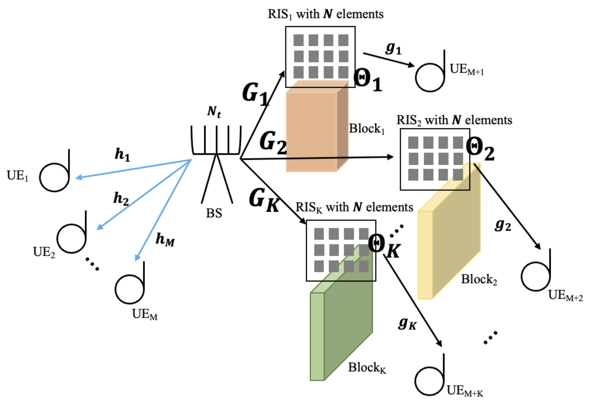

# Neural Network Based Optimization of Transmit Beamforming and RIS Coefficients Using Channel Covariances in MISO Downlink

<b>Authors</b>: Khin Thandar Kyaw, Wiroonsak Santipacha, Kritsada Mamat, Kamol Kaemarungsi, Kazuhiko Fukawa, Lunchakorn Wuttisittikulkij

## Citation

> [!IMPORTANT]
> Manuscript Number: AEUE-D-24-02543R1 has been accepted.

---

## System Model

    

## Implementation
Please refer the paper for implementation details.

## Numerical Results

    
    
    
    
    
    
    
    
    

